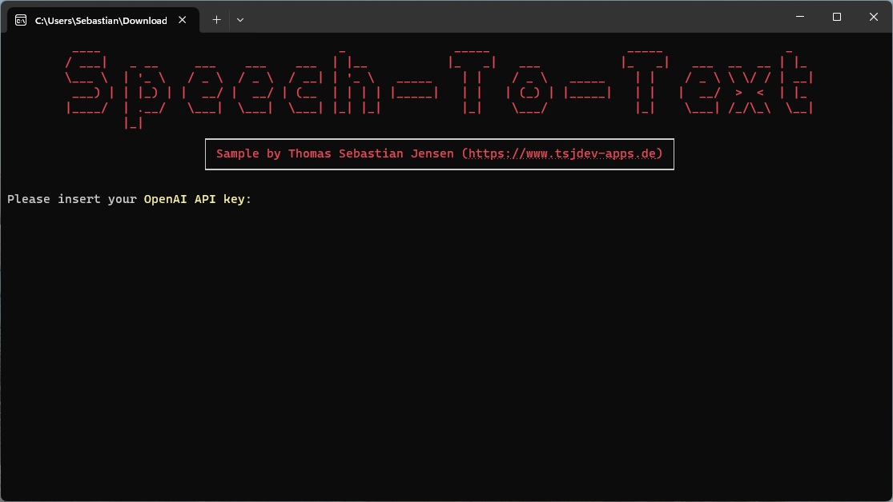

# Speech-To-Text with OpenAI

This repository contains a simple console application written in .NET 8 to demonstrate how to use the Speech-To-Text API by [OpenAI](https://openai.com) to generate a MP3 file from a text.

## Usage

You need to create an OpenAI account on this [website](https://platform.openai.com/docs/overview). You have to pay to use the API so make sure that you add your payment information. After that, you can create an API Key [here](https://platform.openai.com/api-keys) for further use.

Just run the app and follow the steps displayed on the screen.

## Screenshots

Here you can see the console application in action:

## Blog Post

If you are more interested into details, please see the following [medium.com](https://www.medium.com) post:

- [Use OpenAI’s Speech-To-Text API to transcribe audio files](https://medium.com/medialesson/use-openais-speech-to-text-api-to-transcribe-audio-files-f66dd3d7d134)